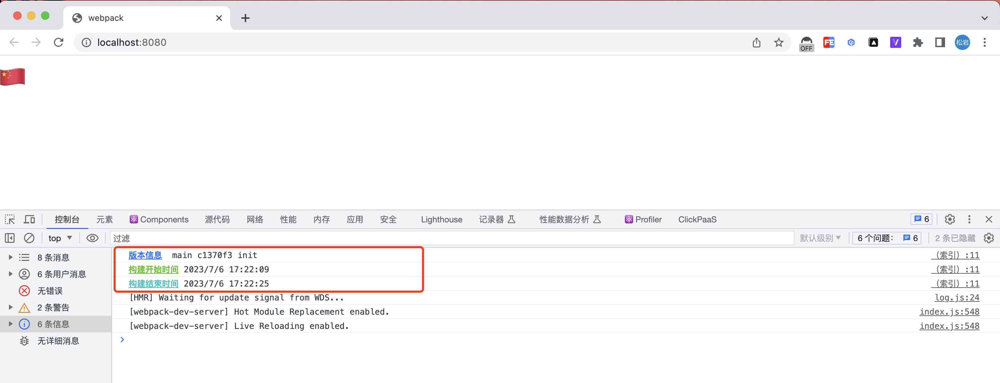

# webpack plugin

Display build information on the browser console


```js
// webpack.config.js
const WebpackBuildInfo = require("webpack-build-info")

{
  ...

  plugins: [
    new WebpackBuildInfo(),

    new WebpackBuildInfo({
      // 支持自定义插件插入在 index.html 的 script 标签 id
      scriptId: "element-id",
      // 支持自定义打印格式
      format(info) {
        return `console.log('${info.gitInfo} - ${info.startTime} - ${info.endTime}')`
      }
    }),
  ]

  ...
}


```

