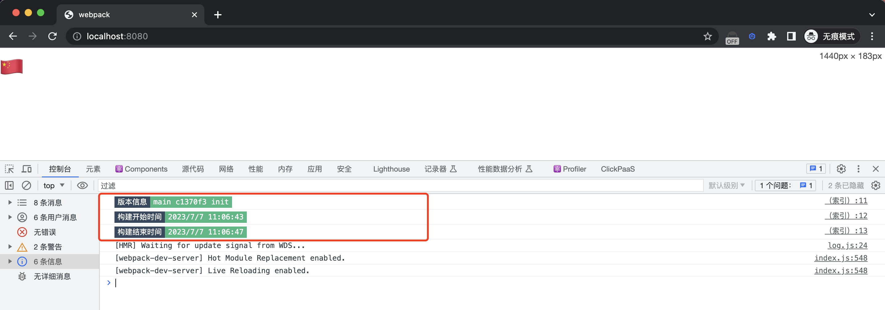

# webpack plugin

Display build information on the browser console

### 使用效果


### 使用说明
```js
// webpack.config.js
const WebpackBuildInfo = require("webpack-build-info")

{
  ...

  plugins: [
    // 简单使用
    new WebpackBuildInfo(),

    // 进阶使用
    new WebpackBuildInfo({
      // 自定义日志触发方式。构建信息默认自动打印在浏览器控制台，如果配置了 trigger 则需要手动在控制台输入配置的属性才会打印构建信息
      trigger: "buildInfo",
      // 自定义额外的构建参数
      extraParams: [
        {
          name: "构建人",
          value: "小明",
        }
      ],
      // 自定义插件插入在 index.html 的 script 标签 id
      scriptId: "element-id",
      // 自定义输出格式
      format(info) {
        return `console.log('${info.gitInfo} - ${info.startTime} - ${info.endTime}')`
      }
    }),
  ]

  ...
}


```

