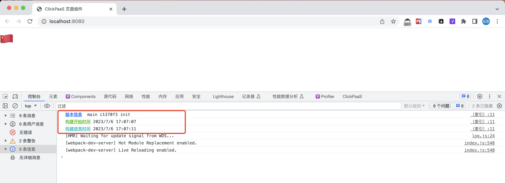

# webpack plugin

Display build information on the browser console


```js
// webpack.config.js
const WebpackBuildInfo = require("webpack-build-info")

{
  ...

  plugins: [
    new WebpackBuildInfo(),

    // 自定义
    new WebpackBuildInfo({
      format(info) {
        return `console.log('${info.gitInfo} - ${info.startTime} - ${info.endTime}')`
      }
    }),
  ]

  ...
}


```

